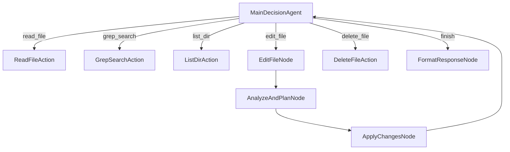

# 用Cursor构建Cursor：创建你自己的AI编码代理的分步指南


你是否曾经希望可以自定义你的AI编码助手，让它完全按照你想要的方式工作？如果你可以使用Cursor本身来构建你自己的Cursor版本——一个AI驱动的代码编辑器呢？这正是我们在本教程中要做的事情：创建一个可定制的、开源的AI编码代理，就在Cursor内部运行。

在这个分步指南中，我们将深入代码，向你展示如何构建一个强大的AI助手，它可以：

- 导航和理解代码库
- 基于自然语言指令实现代码更改
- 智能决定检查或修改哪些文件
- 从其操作历史中学习

让我们开始吧！

## 目录

1. [理解架构](#understanding-the-architecture-1)
2. [设置环境](#setting-up-your-environment-2)
3. [核心：使用Pocket Flow构建](#the-core-building-with-pocket-flow-3)
4. [实现决策制定](#implementing-decision-making-4)
5. [文件操作：读取和编写代码](#file-operations-reading-and-writing-code-5)
6. [代码分析和规划](#code-analysis-and-planning-6)
7. [应用代码更改](#applying-code-changes-7)
8. [运行你的代理](#running-your-agent-8)
9. [高级：自定义你的代理](#advanced-customizing-your-agent-9)
10. [结论和下一步](#conclusion-and-next-steps-10)

<a id="understanding-the-architecture-1"></a>
## 1. 理解架构

在编写任何代码之前，让我们理解我们的Cursor代理的架构。该系统基于使用[Pocket Flow](https://github.com/The-Pocket/PocketFlow)的基于流程的架构构建，这是一个极简的100行LLM框架，支持代理开发。

以下是我们架构的高级概述：



这个架构将关注点分离到不同的节点：
- 决策制定（下一步执行什么操作）
- 文件操作（读取、写入和搜索）
- 代码分析（理解和规划更改）
- 代码修改（安全应用更改）

<a id="setting-up-your-environment-2"></a>
## 2. 设置环境

让我们准备好环境：

```bash
# 克隆仓库
git clone https://github.com/The-Pocket/Tutorial-Cursor
cd Tutorial-Cursor

# 安装依赖
pip install -r requirements.txt
```

<a id="the-core-building-with-pocket-flow-3"></a>
## 3. 核心：使用Pocket Flow构建

我们的代理基于Pocket Flow框架构建，它提供了三个核心抽象：

1. **节点**：执行特定任务的单个计算单元
2. **流程**：定义程序执行路径的节点的有向图
3. **共享存储**：所有节点都可以访问的字典，用于共享数据

让我们看看核心导入和设置：

```python
# flow.py
from pocketflow import Node, Flow, BatchNode
import os
import yaml
import logging
from datetime import datetime
from typing import List, Dict, Any, Tuple

# 导入工具函数
from utils.call_llm import call_llm
from utils.read_file import read_file
from utils.delete_file import delete_file
from utils.replace_file import replace_file
from utils.search_ops import grep_search
from utils.dir_ops import list_dir
```

这导入了Pocket Flow的核心类和我们的自定义工具函数，这些函数处理文件操作和LLM调用。

<a id="implementing-decision-making-4"></a>
## 4. 实现决策制定

我们代理的核心是`MainDecisionAgent`，它根据用户的请求和系统的当前状态决定采取什么行动。

以下是它的实现方式：

```python
class MainDecisionAgent(Node):
    def prep(self, shared: Dict[str, Any]) -> Tuple[str, List[Dict[str, Any]]]:
        # 获取用户查询和历史
        user_query = shared.get("user_query", "")
        history = shared.get("history", [])
        
        return user_query, history
    
    def exec(self, inputs: Tuple[str, List[Dict[str, Any]]]) -> Dict[str, Any]:
        user_query, history = inputs
        
        # 格式化历史以提供上下文
        history_str = format_history_summary(history)
        
        # 为LLM创建提示
        prompt = f"""You are a coding assistant that helps modify and navigate code. Given the following request, 
decide which tool to use from the available options.

User request: {user_query}

Here are the actions you performed:
{history_str}

Available tools:
1. read_file: Read content from a file
   - Parameters: target_file (path)

2. edit_file: Make changes to a file
   - Parameters: target_file (path), instructions, code_edit

[... more tool descriptions ...]

Respond with a YAML object containing:
```yaml
tool: one of: read_file, edit_file, delete_file, grep_search, list_dir, finish
reason: |
  detailed explanation of why you chose this tool and what you intend to do
params:
  # parameters specific to the chosen tool
```"""
        
        # 调用LLM决定行动
        response = call_llm(prompt)
        
        # 解析YAML响应
        yaml_content = extract_yaml_from_response(response)
        decision = yaml.safe_load(yaml_content)
        
        # 验证必需字段
        assert "tool" in decision, "Tool name is missing"
        assert "reason" in decision, "Reason is missing"
        
        return decision
    
    def post(self, shared: Dict[str, Any], prep_res: Any, exec_res: Dict[str, Any]) -> str:
        # 将决定添加到历史
        shared.setdefault("history", []).append({
            "tool": exec_res["tool"],
            "reason": exec_res["reason"],
            "params": exec_res.get("params", {}),
            "timestamp": datetime.now().isoformat()
        })
        
        # 返回工具名称以确定下一步执行哪个节点
        return exec_res["tool"]
```

这个节点：
1. 收集用户的查询和之前操作的历史
2. 为LLM格式化包含所有可用工具的提示
3. 调用LLM决定采取什么行动
4. 解析响应并验证它
5. 将决定添加到历史
6. 返回所选工具的名称，这决定了下一步要执行的节点

<a id="file-operations-reading-and-writing-code-5"></a>
## 5. 文件操作：读取和编写代码

让我们看看我们的代理如何读取文件，这是一个基本操作：

```python
class ReadFileAction(Node):
    def prep(self, shared: Dict[str, Any]) -> str:
        # 从最后的历史条目获取参数
        history = shared.get("history", [])
        last_action = history[-1]
        file_path = last_action["params"].get("target_file")
        
        # 确保路径相对于工作目录
        working_dir = shared.get("working_dir", "")
        full_path = os.path.join(working_dir, file_path) if working_dir else file_path
        
        return full_path
    
    def exec(self, file_path: str) -> Tuple[str, bool]:
        # 调用read_file工具，它返回(content, success)的元组
        return read_file(file_path)
    
    def post(self, shared: Dict[str, Any], prep_res: str, exec_res: Tuple[str, bool]) -> str:
        # 解包read_file()返回的元组
        content, success = exec_res
        
        # 在最后的历史条目中更新结果
        history = shared.get("history", [])
        if history:
            history[-1]["result"] = {
                "success": success,
                "content": content
            }
        
        return "decision"  # 回到决策节点
```

`read_file`工具函数本身的实现如下：

```python
def read_file(target_file: str) -> Tuple[str, bool]:
    """
    从文件中读取内容，支持行范围。
    在输出的每行前添加基于1的行号。
    
    Returns:
        包含(带行号的文件内容, 成功状态)的元组
    """
    try:
        if not os.path.exists(target_file):
            return f"Error: File {target_file} does not exist", False
        
        with open(target_file, 'r', encoding='utf-8') as f:
            lines = f.readlines()
            # 为每行添加行号
            numbered_lines = [f"{i+1}: {line}" for i, line in enumerate(lines)]
            return ''.join(numbered_lines), True
            
    except Exception as e:
        return f"Error reading file: {str(e)}", False
```

这提供了文件的清晰、带行号的视图，使LLM更容易在其分析中引用特定行。

<a id="code-analysis-and-planning-6"></a>
## 6. 代码分析和规划

当代理需要修改代码时，它首先使用`AnalyzeAndPlanNode`分析代码并规划更改：

```python
class AnalyzeAndPlanNode(Node):
    def prep(self, shared: Dict[str, Any]) -> Dict[str, Any]:
        # 获取历史
        history = shared.get("history", [])
        last_action = history[-1]
        
        # 获取文件内容和编辑指令
        file_content = last_action.get("file_content")
        instructions = last_action["params"].get("instructions")
        code_edit = last_action["params"].get("code_edit")
        
        return {
            "file_content": file_content,
            "instructions": instructions,
            "code_edit": code_edit
        }
    
    def exec(self, params: Dict[str, Any]) -> List[Dict[str, Any]]:
        file_content = params["file_content"]
        instructions = params["instructions"]
        code_edit = params["code_edit"]
        
        # 为LLM生成提示以分析编辑
        prompt = f"""
As a code editing assistant, I need to convert the following code edit instruction 
and code edit pattern into specific edit operations (start_line, end_line, replacement).

FILE CONTENT:
{file_content}

EDIT INSTRUCTIONS: 
{instructions}

CODE EDIT PATTERN (markers like "// ... existing code ..." indicate unchanged code):
{code_edit}

Analyze the file content and the edit pattern to determine exactly where changes should be made. 
Return a YAML object with your reasoning and an array of edit operations:

```yaml
reasoning: |
  Explain your thinking process about how you're interpreting the edit pattern.

operations:
  - start_line: 10
    end_line: 15
    replacement: |
      # New code here
```"""
        
        # 调用LLM分析编辑
        response = call_llm(prompt)
        
        # 解析响应并提取编辑操作
        yaml_content = extract_yaml_from_response(response)
        result = yaml.safe_load(yaml_content)
        
        # 在共享内存中存储推理
        shared["edit_reasoning"] = result.get("reasoning", "")
        
        # 返回操作
        return result.get("operations", [])
```

这个节点：
1. 从历史中提取文件内容、指令和代码编辑模式
2. 为LLM创建提示以分析编辑
3. 调用LLM确定确切的行号和替换文本
4. 解析响应以提取编辑操作
5. 在共享内存中存储推理
6. 将操作作为字典列表返回

<a id="applying-code-changes-7"></a>
## 7. 应用代码更改

一旦代理规划了更改，它使用`ApplyChangesNode`应用它们：

```python
class ApplyChangesNode(BatchNode):
    def prep(self, shared: Dict[str, Any]) -> List[Dict[str, Any]]:
        # 获取编辑操作
        edit_operations = shared.get("edit_operations", [])
        
        # 按start_line降序排序编辑操作
        # 这确保当我们从底部到顶部编辑时，行号保持有效
        sorted_ops = sorted(edit_operations, key=lambda op: op["start_line"], reverse=True)
        
        # 从历史中获取目标文件
        history = shared.get("history", [])
        last_action = history[-1]
        target_file = last_action["params"].get("target_file")
        
        # 确保路径相对于工作目录
        working_dir = shared.get("working_dir", "")
        full_path = os.path.join(working_dir, target_file) if working_dir else target_file
        
        # 将文件路径附加到每个操作
        for op in sorted_ops:
            op["target_file"] = full_path
        
        return sorted_ops
    
    def exec(self, op: Dict[str, Any]) -> Tuple[bool, str]:
        # 调用replace_file工具替换内容
        return replace_file(
            target_file=op["target_file"],
            start_line=op["start_line"],
            end_line=op["end_line"],
            content=op["replacement"]
        )
    
    def post(self, shared: Dict[str, Any], prep_res: List[Dict[str, Any]], exec_res_list: List[Tuple[bool, str]]) -> str:
        # 检查所有操作是否成功
        all_successful = all(success for success, _ in exec_res_list)
        
        # 在历史中更新编辑结果
        history = shared.get("history", [])
        if history:
            history[-1]["result"] = {
                "success": all_successful,
                "operations": len(exec_res_list),
                "details": [{"success": s, "message": m} for s, m in exec_res_list],
                "reasoning": shared.get("edit_reasoning", "")
            }
        
        return "decision"  # 回到决策节点
```

这个节点是一个`BatchNode`，允许它在单次运行中处理多个操作。它：
1. 从共享内存获取编辑操作
2. 按起始行降序排序它们，确保编辑保持有效
3. 将目标文件路径附加到每个操作
4. 使用`replace_file`工具执行每个操作
5. 用结果更新历史
6. 返回到决策节点

`replace_file`工具通过组合`remove_file`和`insert_file`工作：

```python
def replace_file(target_file: str, start_line: int, end_line: int, content: str) -> Tuple[str, bool]:
    try:
        # 首先，移除指定的行
        remove_result, remove_success = remove_file(target_file, start_line, end_line)
        
        if not remove_success:
            return f"Error during remove step: {remove_result}", False
        
        # 然后，在起始行插入新内容
        insert_result, insert_success = insert_file(target_file, content, start_line)
        
        if not insert_success:
            return f"Error during insert step: {insert_result}", False
        
        return f"Successfully replaced lines {start_line} to {end_line}", True
        
    except Exception as e:
        return f"Error replacing content: {str(e)}", False
```

<a id="running-your-agent-8"></a>
## 8. 运行你的代理

现在我们已经实现了所有关键组件，让我们在`main.py`中将它们全部组合在一起：

```python
import os
import argparse
import logging
from flow import coding_agent_flow

def main():
    # 解析命令行参数
    parser = argparse.ArgumentParser(description='Coding Agent - AI-powered coding assistant')
    parser.add_argument('--query', '-q', type=str, help='User query to process', required=False)
    parser.add_argument('--working-dir', '-d', type=str, default=os.path.join(os.getcwd(), "project"), 
                        help='Working directory for file operations')
    args = parser.parse_args()
    
    # 如果没有通过命令行提供查询，则询问用户
    user_query = args.query
    if not user_query:
        user_query = input("What would you like me to help you with? ")
    
    # 初始化共享内存
    shared = {
        "user_query": user_query,
        "working_dir": args.working_dir,
        "history": [],
        "response": None
    }
    
    # 运行流程
    coding_agent_flow.run(shared)

if __name__ == "__main__":
    main()
```

最后，让我们在`flow.py`中创建流程：

```python
# 定义节点
main_decision = MainDecisionAgent()
read_file_action = ReadFileAction()
grep_search_action = GrepSearchAction()
list_dir_action = ListDirAction()
delete_file_action = DeleteFileAction()
edit_file_node = EditFileNode()
analyze_plan_node = AnalyzeAndPlanNode()
apply_changes_node = ApplyChangesNode()
format_response_node = FormatResponseNode()

# 连接节点
main_decision - "read_file" >> read_file_action
main_decision - "grep_search" >> grep_search_action
main_decision - "list_dir" >> list_dir_action
main_decision - "delete_file" >> delete_file_action
main_decision - "edit_file" >> edit_file_node
main_decision - "finish" >> format_response_node

# 将操作节点连接回主决策
read_file_action - "decision" >> main_decision
grep_search_action - "decision" >> main_decision
list_dir_action - "decision" >> main_decision
delete_file_action - "decision" >> main_decision

# 连接编辑流程
edit_file_node - "analyze" >> analyze_plan_node
analyze_plan_node - "apply" >> apply_changes_node
apply_changes_node - "decision" >> main_decision

# 创建流程
coding_agent_flow = Flow(start=main_decision)
```

现在你可以用以下命令运行你的代理：

```bash
python main.py --query "List all Python files" --working-dir ./project
```

<a id="advanced-customizing-your-agent-9"></a>
## 9. 高级：自定义你的代理

这个架构最强大的方面之一就是它很容易自定义。让我们探索几种扩展这个代理的方法：

### 1. 添加新工具

要添加新工具，只需：
1. 创建新的操作节点类
2. 将其添加到`MainDecisionAgent`的提示中
3. 将其连接到流程

例如，要添加"run_tests"工具：

```python
class RunTestsAction(Node):
    def prep(self, shared):
        # 从参数获取测试目录
        history = shared.get("history", [])
        last_action = history[-1]
        test_dir = last_action["params"].get("test_dir")
        return test_dir
    
    def exec(self, test_dir):
        # 运行测试并捕获输出
        import subprocess
        result = subprocess.run(
            ["pytest", test_dir], 
            capture_output=True, 
            text=True
        )
        return result.stdout, result.returncode == 0
    
    def post(self, shared, prep_res, exec_res):
        # 用测试结果更新历史
        output, success = exec_res
        history = shared.get("history", [])
        if history:
            history[-1]["result"] = {
                "success": success,
                "output": output
            }
        return "decision"

# 然后添加到你的流程：
run_tests_action = RunTestsAction()
main_decision - "run_tests" >> run_tests_action
run_tests_action - "decision" >> main_decision
```

### 2. 改进代码分析

你可以通过修改`AnalyzeAndPlanNode`中的提示来增强代码分析能力：

```python
# 添加语言特定的提示
language_hints = {
    ".py": "This is Python code. Look for function and class definitions.",
    ".js": "This is JavaScript code. Look for function declarations and exports.",
    # 根据需要添加更多语言
}

# 用语言特定提示更新提示
file_ext = os.path.splitext(target_file)[1]
language_hint = language_hints.get(file_ext, "")
prompt += f"\n\nLANGUAGE HINT: {language_hint}"
```

### 3. 添加内存和上下文

为了给你的代理更多上下文，你可以添加一个向量数据库来存储和检索相关信息：

```python
class VectorDBNode(Node):
    def prep(self, shared):
        # 获取要存储的文本
        history = shared.get("history", [])
        context = ""
        for action in history:
            if action["tool"] == "read_file" and action.get("result", {}).get("success", False):
                content = action["result"]["content"]
                context += f"File: {action['params']['target_file']}\n{content}\n\n"
        return context
    
    def exec(self, context):
        # 存储在向量数据库中
        embeddings = OpenAIEmbeddings()
        vectordb = Chroma.from_texts(
            texts=[context], 
            embedding=embeddings,
            persist_directory="./db"
        )
        return vectordb
    
    def post(self, shared, prep_res, exec_res):
        shared["vectordb"] = exec_res
        return "decision"
```

<a id="conclusion-and-next-steps-10"></a>
## 10. 结论和下一步

恭喜！你已经构建了一个可定制的AI编码代理，它可以根据自然语言指令帮助你导航和修改代码。这个代理展示了代理开发的力量，其中AI系统帮助构建更好的AI系统。

扩展这个代理的可能性是无限的：
- 添加对更多编程语言的支持
- 实现代码重构功能
- 为特定框架创建专门的工具
- 在进行更改之前添加安全检查
- 实现静态分析以捕获潜在错误

随着LLM能力的持续改进，像这样的代理将成为开发者工具包中更强大的工具。

想了解更多？订阅我们的[YouTube频道](https://www.youtube.com/@ZacharyLLM?sub_confirmation=1)，观看构建和扩展这个代理的分步视频教程。

编码愉快！
