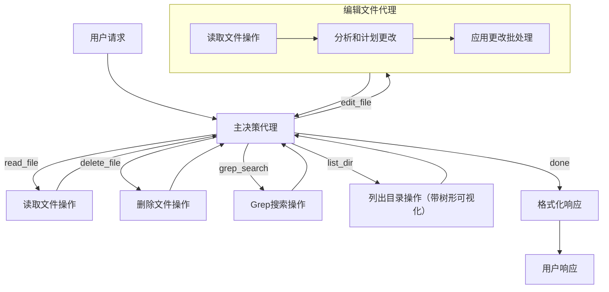

# 设计文档：编码代理

> 请不要删除AI的注释

## 需求

> AI注释：保持简单明了。
> 如果需求是抽象的，请写具体的用户故事

基于以下cursor指令实现一个编码代理：

```
API参数和工具使用
==================

1. 文件操作：
   - read_file：
     * target_file：文件路径（相对或绝对）
     * explanation：解释目的的一句话
     * （注意：将自动读取整个文件）

   - edit_file：
     * target_file：要修改的文件路径
     * instructions：清晰的单句编辑描述
     * code_edit：带有上下文的代码更改，遵循以下规则：
       - 使用"// ... existing code ..."表示编辑之间未更改的代码
       - 包含足够的上下文来消除歧义
       - 最小化重复未更改的代码
       - 永远不要省略代码而不使用"// ... existing code ..."标记
       - 无需指定行号 - 上下文帮助定位更改
       示例：
       ```
       // ... existing code ...
       function newEdit() {
         // new code here
       }
       // ... existing code ...
       ```

   - delete_file：
     * target_file：要删除的文件路径
     * explanation：删除的目的

2. 搜索操作：
   - grep_search：
     * query：要查找的确切文本或正则表达式模式
     * case_sensitive：可选的布尔值
     * include_pattern：可选的文件类型过滤器（如"*.ts"）
     * exclude_pattern：要排除的可选文件
     * explanation：搜索的目的
     注意：结果限制为50个匹配项

3. 目录操作：
   - list_dir：
     * relative_workspace_path：要列出内容的路径
     * explanation：列出的目的

重要说明：
- 所有文件路径都可以是相对的
- 解释应该清晰简洁
- 工具调用必须包含所有必需的参数
- 可选参数仅在必要时包含
- 在可用时使用用户提供的确切值
- 文件搜索结果限制为10个结果
```

我们还想添加一个代码编辑代理，在给定上下文的情况下更新文件。

注意：出于教育目的，该指令是cursor的简化版本。具体来说：
1. 对于read_file，cursor AI通过行号指定的小块读取，最多250行。
   按块读取是避免大文件的好做法。
   但是，这里我们直接读取整个文件。
2. 对于搜索，Cursor AI还支持codebase_search（嵌入）和file_search（模糊文件名）。
   这里，我们只考虑grep_search。
3. Cursor AI还支持run_terminal_cmd、web_search、diff_history。
   这里，我们排除这些操作。

## 流程设计

> AI注释：
> 1. 考虑代理、map-reduce、rag和workflow的设计模式。如果适用则应用它们。
> 2. 提供工作流程的简洁、高级描述。

### 适用的设计模式

1. 主决策代理
    - **上下文**：用户输入、系统上下文和之前的操作结果
    - **操作空间**：
      - `read_file`：{target_file, explanation}
      - `edit_file`：{target_file, instructions, code_edit}
      - `delete_file`：{target_file, explanation}
      - `grep_search`：{query, case_sensitive, include_pattern, exclude_pattern, explanation}
      - `list_dir`：{relative_workspace_path, explanation}
      - `finish`：向用户返回最终响应
    - **流程**：
      1. 解析用户请求并检查当前状态
      2. 将请求与可用工具匹配
      3. 选择工具并准备参数
      4. 运行工具或调用编辑文件代理
      5. 分析结果并决定下一步（另一个工具或完成）
      6. 完成时，格式化最终响应

2. 编辑文件代理
    - **上下文**：文件路径、内容和编辑指令
    - **内部流程**：
      1. **读取文件操作**：
          - 读取目标文件以了解完整上下文
          - 参数：{target_file, explanation="Reading for edit analysis"}
          - 为分析提供完整的代码结构
      
      2. **分析和计划更改节点**：
          - 审查来自主代理的编辑指令
          - 输出格式化的特定编辑列表：
            ```
            [
              {
                start_line: int,  // 要替换的第一行（从1开始）
                end_line: int,    // 要替换的最后一行（从1开始）
                replacement: str  // 新代码
              },
              ...
            ]
            ```
      
      3. **应用更改批处理节点**：
          - 处理计划中的每个编辑
          - 按start_line**降序**排序编辑（从文件底部到顶部）
          - 这确保所有编辑的行号保持有效，因为对后面行的更改不会影响前面行的位置
          - 按正确顺序应用编辑以处理重叠更改

### 流程高级设计



## 工具函数

> AI注释：
> 1. 通过查看文档彻底理解工具函数定义。
> 2. 仅包含基于流程中节点的必要工具函数。

**重要**：工具函数中的所有文件和目录路径都应该相对于共享内存中提供的`working_dir`进行解释。工具应该通过将`working_dir`与它们作为参数接收的相对路径连接来构造绝对路径。

1. **调用LLM**（`utils/call_llm.py`）
   - 向语言模型服务发出API调用
   - 输入：prompt/messages
   - 输出：LLM响应文本

2. **文件操作**
   - **读取文件**（`utils/read_file.py`）
     - 从指定文件读取内容
     - 输入：target_file
     - 输出：文件内容、成功状态
   
   - **插入文件**（`utils/insert_file.py`）
     - 向目标文件写入或插入内容
     - 输入：target_file, content, line_number
     - 输出：结果消息、成功状态
   
   - **移除文件**（`utils/remove_file.py`）
     - 根据行号从文件中移除内容
     - 输入：target_file, start_line（可选）, end_line（可选）
     - 输出：结果消息、成功状态
   
   - **删除文件**（`utils/delete_file.py`）
     - 从文件系统中删除文件
     - 输入：target_file
     - 输出：结果消息、成功状态
   
   - **替换文件**（`utils/replace_file.py`）
     - 根据行号替换文件中的内容
     - 输入：target_file, start_line, end_line, new_content
     - 输出：结果消息、成功状态

3. **搜索操作**（`utils/search_ops.py`）
   - **Grep搜索**
     - 使用类似ripgrep的功能在文件中搜索特定模式
     - 输入：query, case_sensitive（可选）, include_pattern（可选）, exclude_pattern（可选）, working_dir（可选）
     - 输出：匹配项列表（文件路径、行号、内容）、成功状态
   
4. **目录操作**（`utils/dir_ops.py`）
   - **列出目录**
     - 列出目录内容并显示树形可视化
     - 输入：relative_workspace_path
     - 输出：成功状态、树形可视化字符串

有了这些工具函数，我们可以实现流程设计中定义的节点，创建一个强大的编码代理，可以读取、修改、搜索和导航代码库文件。

## 节点设计

### 共享内存

改进且更简单的共享内存结构：

```python
shared = {
    # 用户的原始查询
    "user_query": str,
    
    # 当前工作目录 - 所有文件操作都相对于此路径
    "working_dir": str,    # 重要：操作中的所有文件路径都相对于此目录进行解释
    
    # 操作历史 - 存储所有操作及其结果
    "history": [
        {
            "tool": str,              # 工具名称（如"read_file"）
            "reason": str,            # 调用此工具的简要解释
            "params": dict,           # 工具使用的参数
            "result": any,            # 工具返回的结果
            "timestamp": str          # 执行操作的时间
        }
    ],
    
    # 用于编辑操作（仅在编辑期间使用）
    "edit_operations": [
        {
            "start_line": int,
            "end_line": int,
            "replacement": str
        }
    ],
    
    # 返回给用户的最终响应
    "response": str
}
```

### 节点步骤

1. 主决策代理节点
- **目的**：解释用户请求并决定使用哪个工具
- **类型**：常规节点
- **步骤**：
  - **prep**：
    - 读取`shared["user_query"]`和`shared["history"]`
    - 返回用户查询和相关历史
  - **exec**：
    - 调用LLM决定使用哪个工具并准备参数
    - 返回工具名称、使用原因和参数
  - **post**：
    - 将新操作添加到`shared["history"]`，包含工具、原因和参数
    - 返回所选工具的操作字符串

2. 读取文件操作节点
- **目的**：读取指定文件内容
- **类型**：常规节点
- **步骤**：
  - **prep**：
    - 从`shared["history"]["params"]`的最后一项获取文件路径
    - 确保路径相对于`shared["working_dir"]`进行解释
    - 返回文件路径
  - **exec**：
    - 使用路径调用read_file工具
    - 返回文件内容
  - **post**：
    - 用结果更新最后的历史条目
    - 返回"decide_next"

3. Grep搜索操作节点
- **目的**：在文件中搜索模式
- **类型**：常规节点
- **步骤**：
  - **prep**：
    - 从`shared["history"]["params"]`的最后一项获取搜索参数
    - 确保任何路径模式都相对于`shared["working_dir"]`进行解释
    - 返回搜索参数
  - **exec**：
    - 调用grep_search工具
    - 返回搜索结果
  - **post**：
    - 用结果更新最后的历史条目
    - 返回"decide_next"

4. 列出目录操作节点
- **目的**：列出目录内容并显示树形可视化
- **类型**：常规节点
- **步骤**：
  - **prep**：
    - 从`shared["history"]["params"]`的最后一项获取目录路径
    - 确保路径相对于`shared["working_dir"]`进行解释
    - 返回路径
  - **exec**：
    - 调用list_dir工具，现在返回(success, tree_str)
    - 返回成功状态和树形可视化字符串
  - **post**：
    - 用结果更新最后的历史条目：
      ```python
      history_entry = shared["history"][-1]
      success, tree_str = exec_res
      history_entry["result"] = {
          "success": success,
          "tree_visualization": tree_str
      }
      ```
    - 返回"decide_next"

5. 删除文件操作节点
- **目的**：删除文件
- **类型**：常规节点
- **步骤**：
  - **prep**：
    - 从`shared["history"]["params"]`的最后一项获取文件路径
    - 确保路径相对于`shared["working_dir"]`进行解释
    - 返回文件路径
  - **exec**：
    - 调用delete_file工具
    - 返回成功状态
  - **post**：
    - 用结果更新最后的历史条目
    - 返回"decide_next"

6. 读取目标文件节点（编辑代理）
- **目的**：读取文件进行编辑（编辑过程的第一步）
- **类型**：常规节点
- **步骤**：
  - **prep**：
    - 从`shared["history"]["params"]`的最后一项获取文件路径（edit_file操作）
    - 确保路径相对于`shared["working_dir"]`进行解释
    - 返回文件路径
  - **exec**：
    - 调用read_file工具读取整个文件
    - 返回文件内容
  - **post**：
    - 在历史条目中存储文件内容
    - 返回"analyze_plan"

7. 分析和计划更改节点（编辑代理）
- **目的**：计划特定的编辑操作
- **类型**：常规节点
- **步骤**：
  - **prep**：
    - 从历史中获取文件内容
    - 从历史参数中获取编辑指令和code_edit
    - 返回文件内容、指令和code_edit
  - **exec**：
    - 调用LLM分析和创建编辑计划
    - 返回结构化的编辑列表
  - **post**：
    - 在`shared["edit_operations"]`中存储编辑
    - 返回"apply_changes"

8. 应用更改批处理节点（编辑代理）
- **目的**：将编辑应用到文件
- **类型**：BatchNode
- **步骤**：
  - **prep**：
    - 读取`shared["edit_operations"]`
    - 按start_line降序排序
    - 返回排序后的编辑操作
  - **exec**：
    - 对于每个编辑操作，使用以下参数调用replace_file工具：
      - target_file（来自历史）
      - start_line和end_line（来自编辑操作）
      - replacement（来自编辑操作）
    - 返回每个操作的成功状态
  - **post**：
    - 在历史中更新编辑结果
    - 处理完成后清除`shared["edit_operations"]`
    - 返回"decide_next"

9. 格式化响应节点
- **目的**：为用户创建响应
- **类型**：常规节点
- **步骤**：
  - **prep**：
    - 读取`shared["history"]`
    - 返回历史
  - **exec**：
    - 调用LLM生成响应
    - 返回格式化的响应
  - **post**：
    - 在`shared["response"]`中存储响应
    - 返回"done"